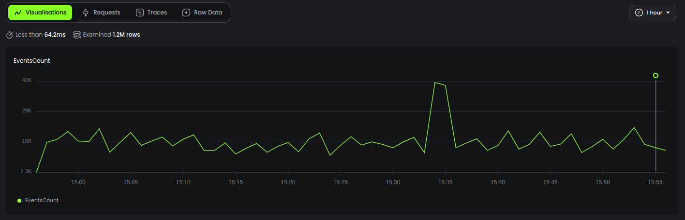

# :gear: action-setup-baselime

[![Documentation][docs_badge]][docs]
[![License][license_badge]][license]


> Setup the Baselime CLI in Github actions

## About
This action sets up the [Baselime CLI](https://baselime.io/docs/cli/install/) in Github Actions.

This action can be run on `ubuntu-latest`, and `macos-latest` GitHub Actions runners, and will install and expose a specified version of the `baselime` CLI on the runner environment.

## Usage

Create a marker for every new deployment

```yaml
steps:
  - uses: baselime/action-setup-baselime@v0.0.1
    with:
      baselime-api-key: ${{ secrets.BASELIME_API_KEY }} # Can be imported from Github Actions Secrets
  - name: 📍Create marker
    run: |
      baselime mark \
      --name Deployment \
      --url "${{ github.server_url }}/${{ github.repository }}/actions/runs/${{ github.run_id }}" \
      --metadata '${{ toJson(github) }}' \
      --service ${{ github.repository }}
```

The marker will be available on the timeline when you query your telemetry data




## Inputs
The actions supports the following inputs:

- `baselime-api-key`: The API key to use with the Baselime CLI. You can get your API key  in the [Baselime console](https://console.baselime.io)
- `version`: The version of `baselime` to install, defaulting to the latest version

## Contributing

Feel free to submit PRs or to fill issues. Every kind of help is appreciated. 

Kindly check our [Contributing](CONTRIBUTING.md) guide on how to propose
bugfixes and improvements, and submitting pull requests to the project.

## License

&copy; Baselime Limited, 2022

Distributed under MIT License (`The MIT License`).

See [LICENSE](LICENSE) for more information.

<!-- Badges -->

[docs]: https://baselime.io/docs/
[docs_badge]: https://img.shields.io/badge/docs-reference-blue.svg?style=flat-square
[license]: https://opensource.org/licenses/MIT
[license_badge]: https://img.shields.io/github/license/baselime/cli.svg?color=blue&style=flat-square&ghcache=unused

